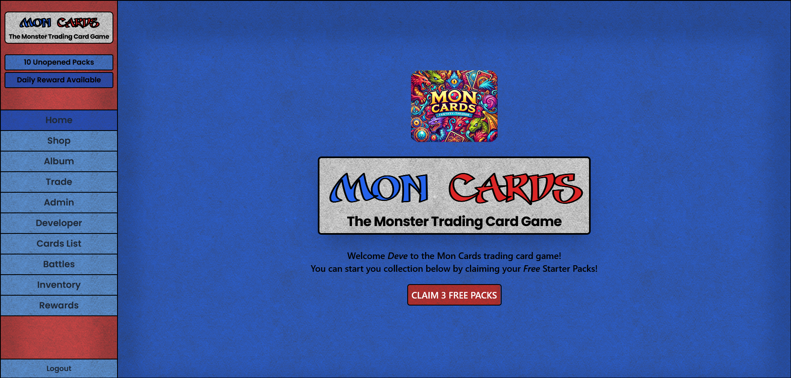
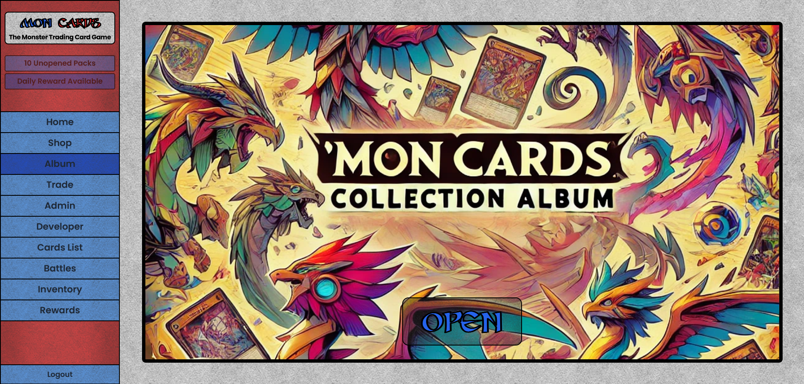
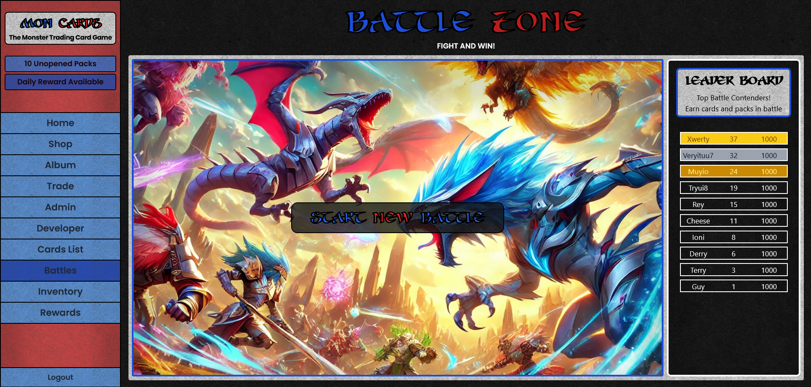
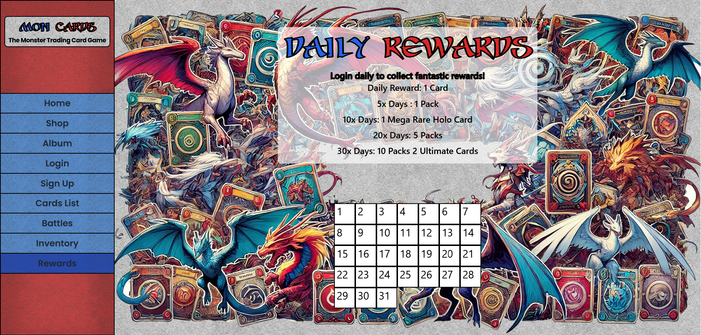
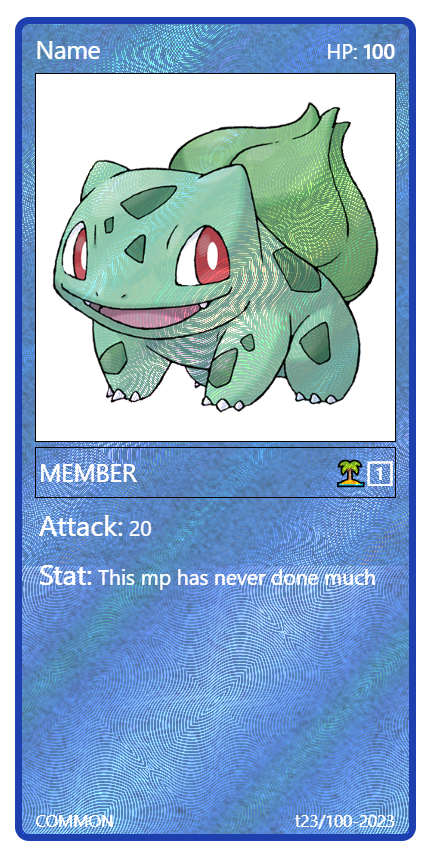

# MonCards - Trading Card Game

Sticker book and battle card collecting game - Pokemon style

Live Link [MonCards](https://mon-cards.netlify.app/)

This game has all the classic features of a card collecting game including,
Collecting Album, Holographic cards, Rariry levels, Trading functions, Basic battles, Daily rewards and Shop.

## Table of contents

- [MonCards - Trading Card Game](#moncards---trading-card-game)
  - [Table of contents](#table-of-contents)
  - [General Info](#general-info)
  - [Images](#images)
  - [Features](#features)
  - [Technologies](#technologies)
  - [Cards](#cards)
  - [Rariry Level and Holographic Cards](#rariry-level-and-holographic-cards)
  - [Serial numbers](#serial-numbers)

## General Info

The Trading Card Game is a sticker book and card collecting game inspired by Pokémon. It includes all the classic features such as collecting albums, holographic cards, rarity levels, trading functions, basic battles, daily rewards, and a shop. Additionally, it has admin functions for creating and editing cards, and managing users and events.

## Images

  

  

  

  

## Features

- **Collecting Album**: Organize and view your collection.
- **Holographic Cards**: Special cards with a holographic finish.
- **Rarity Levels**: Various levels of rarity for cards.
- **Trading Functions**: Trade cards with other players.
- **Basic Battles**: Engage in battles using your collected cards.
- **Daily Rewards**: Earn rewards by logging in daily.
- **Shop**: Purchase packs and items.
- **Admin Functions**: Create and edit cards, manage users, and organize events.

## Technologies

**Frontend**:

- React
- JavaScript
- Tailwind CSS
- Axios

**Backend**:

- Express
- Prisma
- JavaScript

## Cards

There are 3 types of cards

1. Monster Card - Main playable character card
2. Power Up Card - Power up your character - attack, defence, specail attack,
3. Item Card - A effect that can be caused in the game - skip turn, gain, lose.

The rarity levels are

1. Common
2. Uncommon
3. Rare
4. Rare Holographic
5. Mega Rare
6. Mega Rare Holo
7. Ultimate (Holo only)

There are 3 type of pack

1. Alpha
2. Beta
3. Gamma

## Rariry Level and Holographic Cards

There are 7 levels of card rariry
The Rare cards can be found with holo or non holo versions
Ultimate cards will have a whole page of holograpgic material

## Serial numbers

Card Examples
Serial Numbers:

Format: year-yy - edition-n - serial-0000
Examples: 23-1-BR1001, 23-1-EL1001, 23-1-CO1001
